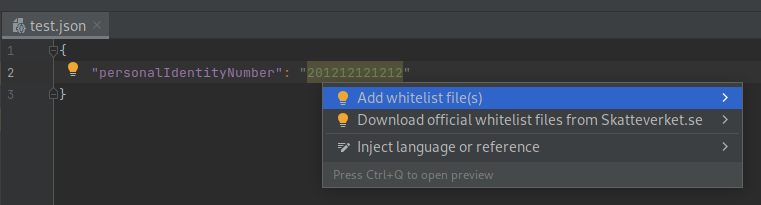
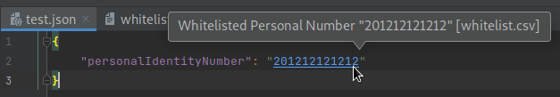
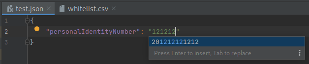

# Swedish Personal Identity Numbers

This is a plugin for Jetbrains IDEs.

It highlights swedish personal identity numbers that are not on an approved white list.

Includes support for:

- Downloading official whitelists from skatteverket.se.
- Navigating from number to whitelist.
- Code completion of numbers from whitelist.
- Coordination numbers ("samordningsnummer").
- Custom formats, including missing millennium or checksum digit.

